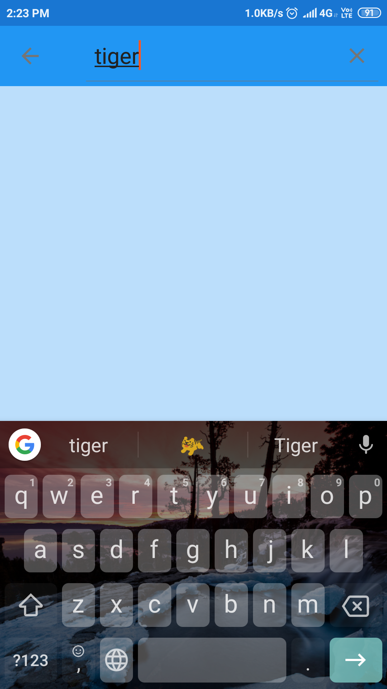
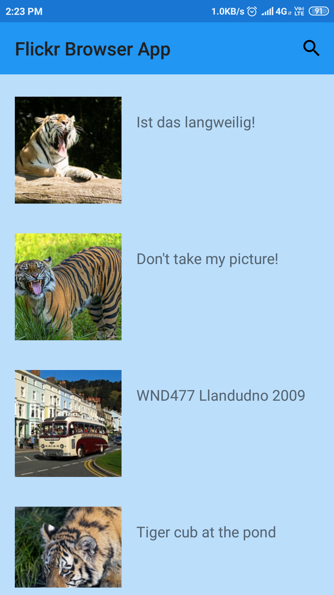
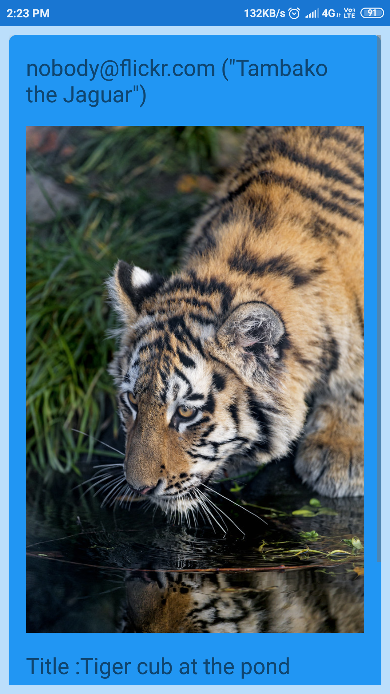

# FlickrBrowserApp
This is an Image Browsing app.
It interacts with the flickr api and feeds and generates the results for the user.
The user can search images related to specific topics or keywords.
These keywords are taken by the searchView widget.
The app then generates the results according to the search criteria.
The user can interact with the list items by clicking the items.
After clicking the item the image is enlarged and the user can see info of the image such as author,title and the tags of the image.

Below is a link to see the app live in action: 
 

<pre>                                 </pre>
<pre>                                                                             </pre>
